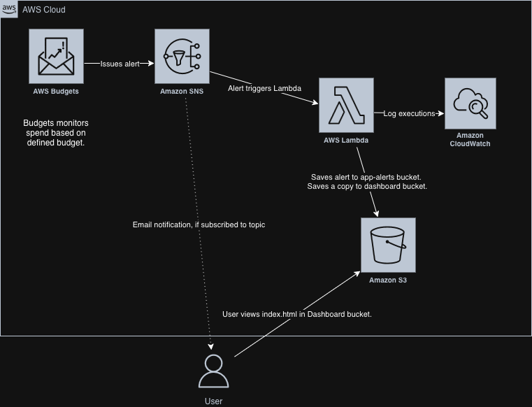
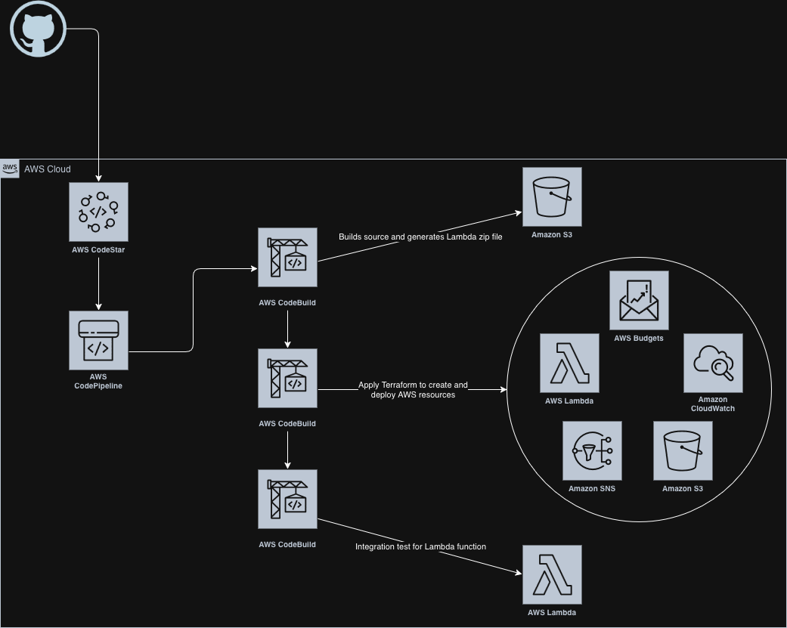

# Cost Sentinel

AWS budget monitoring system with automated alerts and a public dashboard. Built with Terraform, AWS CodePipeline, Lambda, and S3.

## Overview

Cost Sentinel monitors AWS spending and sends alerts when budget thresholds are exceeded. It demonstrates:

- **Infrastructure as Code**: Terraform modules with comprehensive testing
- **CI/CD**: AWS-native pipeline (CodePipeline, CodeBuild, CodeConnections)
- **Security**: Least-privilege IAM, KMS encryption, tag-based policies
- **Serverless Architecture**: Lambda + SNS + S3 for cost-effective monitoring
- **DevOps Best Practices**: Pre-commit hooks, automated testing, integration tests

## Architecture

### Runtime Architecture


### CI/CD Pipeline


### Components

- **AWS Budgets**: Monitors monthly spending against configurable thresholds
- **SNS Topic**: Receives budget alerts (encrypted with KMS)
- **Lambda Function**: Processes alerts and stores them in S3
- **S3 Buckets**:
  - Alert storage (versioned, lifecycle policies)
  - Public dashboard (static website)
- **CloudWatch Logs**: Lambda execution logs (encrypted, 30-day retention)

### Environments

The reusable `sentinel` module is deployed into two independent environments in
the same account, each with its own resources (`cost-sentinel-<env>-*`) and its
own KMS key:

- **prod** — the authoritative, always-on monitor. Prod owns the single
  account-wide AWS Budget and is the live alerting environment. Stateful
  resources are protected with `prevent_destroy`.
- **dev** — a canary for changes. Because AWS Budgets is account-scoped, two
  budgets in one account would both fire on the same spend, so dev runs the full
  stack with its budget disabled (`enable_budget = false`) to stay silent while
  still exercising the SNS → Lambda wiring in integration tests.

The human-facing email alert is subscribed to the prod SNS topic manually via
the Console (kept out of Terraform); the Lambda subscription is Terraform-managed.

## Features

### Security
- Customer-managed KMS keys for encryption
- Least-privilege IAM roles with resource-scoped permissions
- Tag-based IAM conditions for infrastructure management
- S3 bucket versioning and lifecycle policies
- Secrets detection via pre-commit hooks
- No credentials stored in repository

### CI/CD
- Multi-stage pipeline: `Build → DeployDev → IntegrationDev → ApproveProd (manual) → DeployProd → IntegrationProd`
- Manual approval gate before prod (promotes the current dev-validated commit)
- Automated Terraform validation and testing
- Lambda integration tests in pipeline (dev and prod)
- Artifact management with S3
- Remote state with DynamoDB locking (separate state key per environment)

### Infrastructure
- Modular Terraform design
- Terraform native tests
- Conditional resource creation
- Prevent-destroy lifecycle rules on stateful resources
- Cost optimization (lifecycle policies, pay-per-request DynamoDB)

## Prerequisites

- AWS Account
- GitHub Account
- Terraform 1.7.5+ (use `tfenv` for version management)
- Python 3.11+
- AWS CLI configured

## Quick Start

### 1. Bootstrap Infrastructure

```bash
cd infra/bootstrap
cp terraform.tfvars.example terraform.tfvars
# Edit terraform.tfvars with your values
terraform init
terraform apply
```

After apply, authorize the CodeConnections connection in AWS Console.

### 2. Configure Repository

```bash
# Install pre-commit hooks
pip install -r requirements-dev.txt
pre-commit install

# Initialize development environment
./bootstrap-dev.sh
```

### 3. Deploy Application

Push to `main` branch to trigger the pipeline:

```bash
git push origin main
```

The pipeline will:
1. Build and package the Lambda function
2. Run Terraform tests
3. Deploy to **dev** and run integration tests
4. Pause at a **manual approval** gate
5. On approval, deploy to **prod** and run integration tests

> The first prod deploy and any later prod promotion go through the approval
> gate. Standing up a new prod environment also requires a one-time terminal
> apply of `infra/bootstrap` to add the prod pipeline stages — see
> [docs/runbook-prod-cutover.md](docs/runbook-prod-cutover.md).

## Configuration

### Budget Settings

Edit `infra/bootstrap/variables.tf`:

```hcl
monthly_budget_usd = 10
budget_thresholds_percent = [10, 50, 80, 100]
```

### Email Alerts

Prod's email alert is subscribed to the `cost-sentinel-prod-budget-alerts` SNS
topic **manually in the Console** (confirmed once), keeping the address out of
Terraform and state. For dev, you may optionally set `budget_email` in
`terraform.tfvars` to create a Terraform-managed subscription (requires
confirmation); it is normally left unset.

### Dashboard

The dashboard is automatically deployed to an S3 website. Access URL is in Terraform outputs:

```bash
terraform output dashboard_url
```

## Development

### Local Testing

```bash
# Run Terraform tests
make ci-test

# Test Lambda locally
cd app/ingestor
python run_local.py
```

### Pre-commit Hooks

Automatically run on commit:
- Terraform fmt/validate
- Python linting (ruff)
- Secrets detection
- YAML linting

## Project Structure

```
cost-sentinel/
├── app/ingestor/          # Lambda function code
├── infra/
│   ├── bootstrap/         # CI/CD infrastructure (pipeline, state backend)
│   ├── envs/
│   │   ├── dev/           # Dev environment (silent canary)
│   │   └── prod/          # Prod environment (live, owns the budget)
│   └── modules/sentinel/  # Reusable Terraform module
├── web/                   # Dashboard frontend
├── scripts/               # Integration test scripts
└── docs/                  # Post-mortems and runbooks
```

## Cost Profile

Expected monthly cost: **< $6**

- CodePipeline: ~$1
- CodeBuild: $0-$2 (pay per build minute)
- Lambda: $0 (free tier)
- S3: Negligible
- KMS: $1/key/month — one key per environment (dev + prod = ~$2)
- AWS Budgets: Free (first 2 budgets cover dev + prod)

## Security Considerations

- All S3 buckets have public access blocked (except dashboard)
- KMS encryption for Lambda environment variables and SNS topics
- CloudWatch Logs encrypted with KMS
- IAM roles follow least-privilege principle
- No long-lived credentials
- Terraform state encrypted at rest

## Lessons Learned

See `docs/post-mortem-*.md` for detailed incident reports covering:
- Initial deployment challenges
- KMS integration and IAM debugging
- CI/CD pipeline hardening
- Tag-based IAM policy design

## Future Enhancements

- [x] Production environment with approval gates
- [ ] Anomaly detection using AWS Cost Anomaly Detection
- [ ] Slack/Teams integration
- [ ] Cost forecasting dashboard
- [ ] Multi-account support via AWS Organizations
- [ ] Automated rollback on failed deployments

## License

MIT License - See LICENSE file for details

## Author

Greg Blotzer
- GitHub: [@dablotz](https://github.com/dablotz)
- LinkedIn: [My Profile](https://linkedin.com/in/gblotzer)

## Acknowledgments

Built as a demonstration of AWS cloud architecture, IaC best practices, and CI/CD automation.
